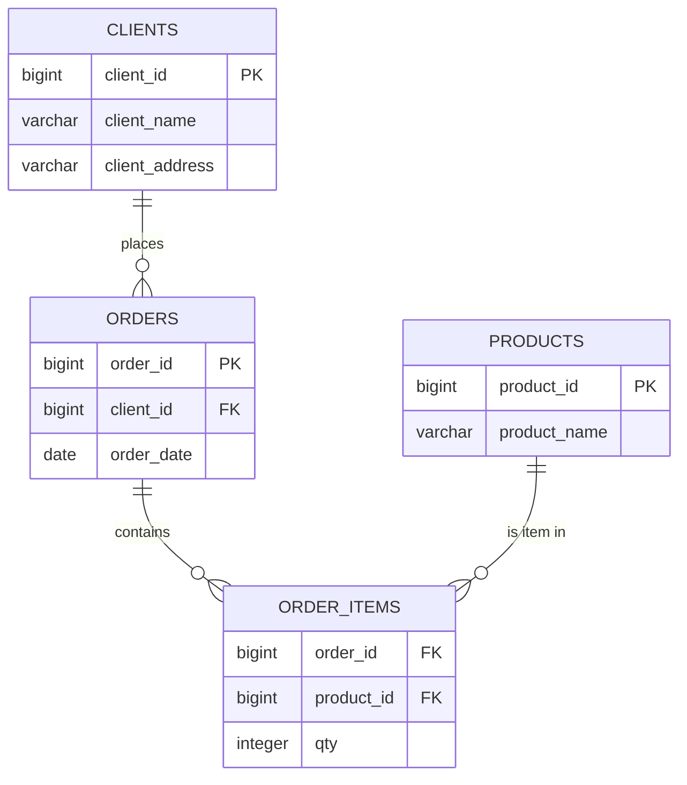

```mermaid
erDiagram
    CLIENTS ||--o{ ORDERS : places
    ORDERS ||--o{ ORDER_ITEMS : contains
    PRODUCTS ||--o{ ORDER_ITEMS : "is item in"

    CLIENTS {
      bigint client_id PK
      varchar client_name
      varchar client_address
    }

    ORDERS {
      bigint order_id PK
      bigint client_id FK
      date   order_date
    }

    PRODUCTS {
      bigint product_id PK
      varchar product_name
    }

    ORDER_ITEMS {
      bigint order_id FK
      bigint product_id FK
      integer qty
    }
```
