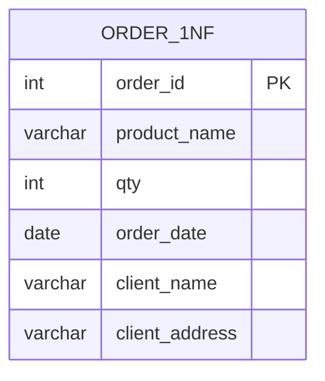
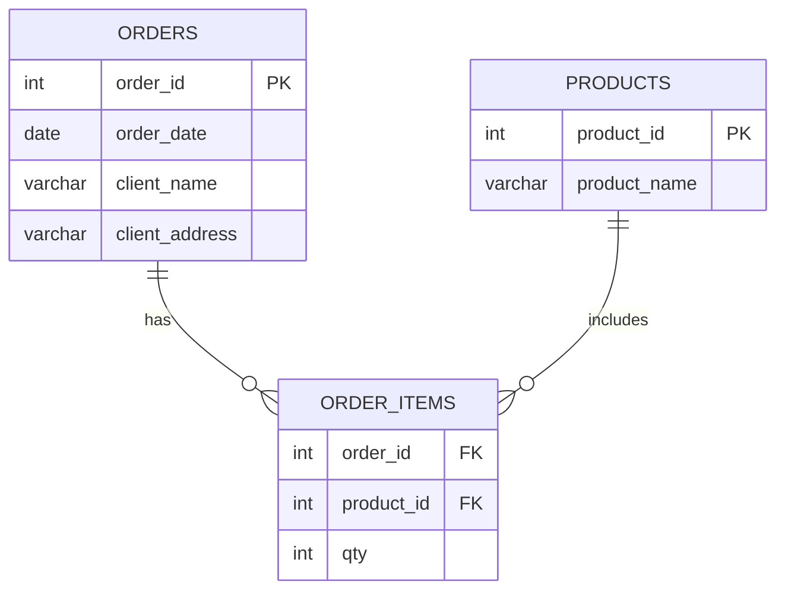
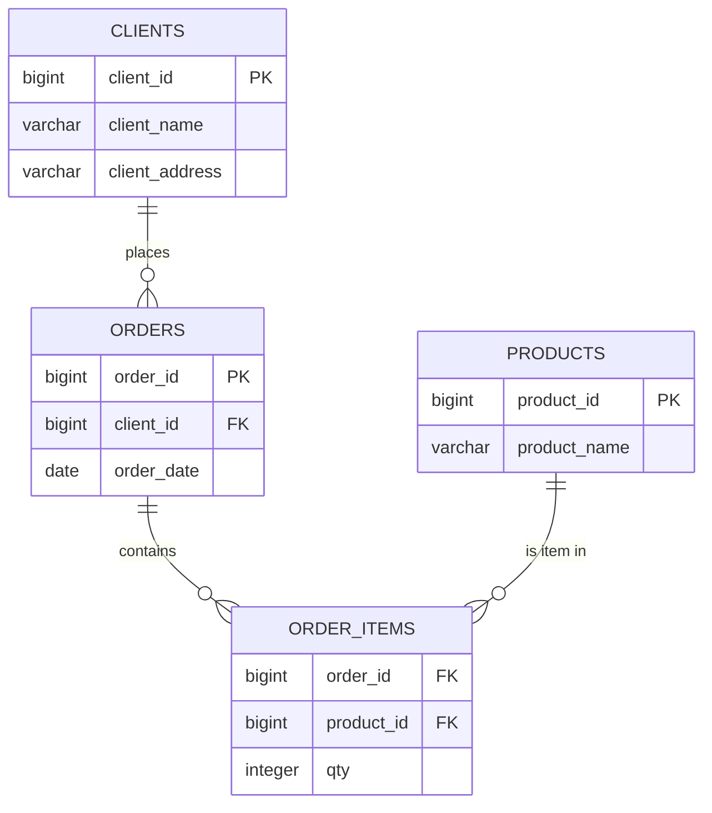
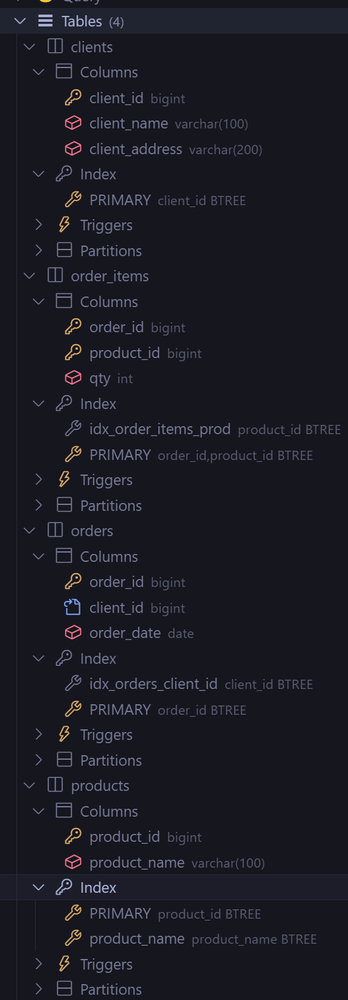

# Database Design Project - E-commerce Order Management System

This project implements a relational database design for an e-commerce order management system using MySQL. The database is designed to handle client orders, product catalog, and order items with proper relationships and constraints.

## 📋 Project Overview

This database schema supports a typical e-commerce scenario where:

- **Clients** can place multiple orders
- **Orders** contain multiple items (products)
- **Products** can be included in multiple orders
- The system tracks quantities and maintains referential integrity

## 🗄️ Database Schema

The database consists of four main tables:

### 1. **clients** - Customer Information

- `client_id` (BIGINT, Primary Key, Auto Increment)
- `client_name` (VARCHAR(100), NOT NULL)
- `client_address` (VARCHAR(200), NOT NULL)

### 2. **products** - Product Catalog

- `product_id` (BIGINT, Primary Key, Auto Increment)
- `product_name` (VARCHAR(100), NOT NULL, UNIQUE)

### 3. **orders** - Order Headers

- `order_id` (BIGINT, Primary Key, Auto Increment)
- `client_id` (BIGINT, Foreign Key → clients.client_id)
- `order_date` (DATE, NOT NULL)

### 4. **order_items** - Order Line Items (Many-to-Many)

- `order_id` (BIGINT, Foreign Key → orders.order_id)
- `product_id` (BIGINT, Foreign Key → products.product_id)
- `qty` (INTEGER, NOT NULL, CHECK constraint > 0)
- **Composite Primary Key**: (order_id, product_id)

## 🔗 Entity Relationship Diagram

### 1NF



### 2NF



### 3NF



## 🖼️ Database Structure Screenshot

The following screenshot shows the database structure as viewed in MySQL Workbench:



## 🚀 Getting Started

### Prerequisites

- MySQL Server 5.7+ or MySQL 8.0+
- MySQL Workbench (optional, for visual management)

### Installation

1. Clone this repository
2. Execute the `create_db.sql` script in your MySQL environment:
   ```sql
   source create_db.sql;
   ```
